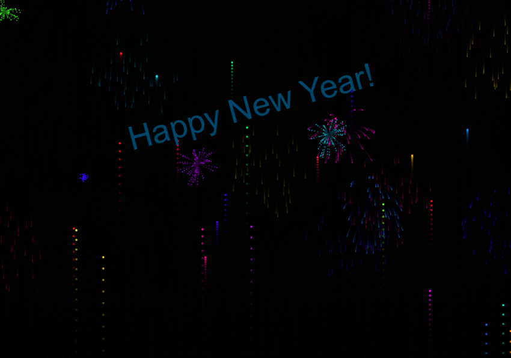

# MMM-Fireworks

Example:




The MMM-Fireworks module brings a visually stunning fireworks display to your MagicMirror, designed to celebrate special occasions. 
The fireworks animation runs best in the fullscreen_above region, creating an immersive experience.
The start time and duration of the display are configurable via the config.js file.

## Installation

### Install

In your terminal, go to your [MagicMirror²][mm] Module folder and clone MMM-Fireworks:

```bash
cd ~/MagicMirror/modules
git clone https://github.com/ChrisF1976/MMM-Fireworks.git
```

### Update

```bash
cd ~/MagicMirror/modules/MMM-Fireworks
git pull
```

## Using the module

To use this module, add it to the modules array in the `config/config.js` file:

```js
	{
	  module: "MMM-Fireworks",
	  position: "fullscreen_above",
	  config: {
	        // Scheduling: an array of event objects with a start time and text message.
    		startDateTime: [
    		   { time: "2025-02-09T07:00:00", text: "Happy Birthday, Homer!" },
    		   { time: "2025-10-03T07:00:00", text: "Happy Birthday, Lisa!" },
    		   { time: "2025-12-31T23:59:55", text: "Happy New Year to my Simpsons!" }
    		   ],
    		duration: 6 * 60 * 60 * 1000,        // Duration in milliseconds (6 hours)
    		// p5 Fireworks settings:
    		fireworkSpawnChance: 0.2, 	        // Chance each frame to spawn a new firework - adjust carefuly beased on your hardware
    		explosionParticleCount: 30, 	    // Number of particles per explosion - adjust carefuly beased on your hardware
    		// Display settings:
    		fullscreen: true,      		        // If false, use defined width/height.
    		width: "400px",
    		height: "500px",
    		// Velocity settings for rocket particles:
    		magnitude_high: -19,		        //adjust to your screen size. Try a little.
    		magnitude_low: -8,		            //adjust to your screen size. Try a little.
    		// Trailing effect transparency:
    		transparency: 10,		            //min: 0 max: 255
    		canvasOpacity: 0.5,		            //opacity for the canvas
    		// Module management:
    		disableAllModules: false,
    		keepModules: ["clock"],
    		// Notification triggers:
    		NotificationStart: "FireFireFire",	//Module listens to this message
    		NotificationStop: "StopFire",		//Module listens to this message
    		textNotification: "Fire!", 		    //used if no text is received from notification
    		// Default text for scheduled events (usually not needed):
            text: "Happy New Year!"
	  }
	},
```

## Features

### Schedules the Display: 
Starts the fireworks effect at a configured date and time for a specified duration.
### Customizable Appearance:
Allows you to adjust parameters such as rocket velocity, explosion particle count, and trailing transparency.
### Flexible Layout:
Can run in full-screen mode or within defined dimensions.
### Module Management:
Optionally hides other modules during the fireworks display (with exceptions you can configure).
### Text Overlay:
Displays customizable overlay text (e.g., "Happy New Year!") with CSS-controlled styling and positioning.

## Configuration options
| Parameter              | Type                      | Default Value                                                                                                                                                                           | Description                                                                                                                                                                                   |
|------------------------|---------------------------|-----------------------------------------------------------------------------------------------------------------------------------------------------------------------------------------|-----------------------------------------------------------------------------------------------------------------------------------------------------------------------------------------------|
| `startDateTime`        | Array of Objects          | `[ { time: "2025-02-09T07:00:00", text: "Happy Birthday, Homer!" }, { time: "2025-10-03T07:00:00", text: "Happy Birthday, Lisa!" }, { time: "2025-12-31T23:59:55", text: "Happy New Year to my Simpsons!" } ]` | An array of scheduled events. Each object specifies a start time (ISO string) and a text message to display during that fireworks event.                                                        |
| `duration`             | Number (milliseconds)     | `6 * 60 * 60 * 1000` (6 hours)                                                                                                                                                           | The duration for which the fireworks effect will run once started, in milliseconds.                                                                                                         |
| `fireworkSpawnChance`  | Number (0–1)              | `0.5`                                                                                                                                                                                  | The probability that a new firework is spawned on each frame of the p5.js sketch. A higher value creates more frequent fireworks.                                                            |
| `explosionParticleCount` | Number                 | `40`                                                                                                                                                                                   | The number of particles generated when a firework (rocket) explodes. Adjust this value based on your hardware performance.                                                                  |
| `fullscreen`           | Boolean                   | `true`                                                                                                                                                                                 | If `true`, the module’s container will cover the entire screen. If `false`, the container will use the dimensions specified by `width` and `height`.                                         |
| `width`                | String                    | `"400px"`                                                                                                                                                                              | The width of the module’s container when `fullscreen` is `false`.                                                                                                                           |
| `height`               | String                    | `"500px"`                                                                                                                                                                              | The height of the module’s container when `fullscreen` is `false`.                                                                                                                          |
| `magnitude_high`       | Number                    | `-19`                                                                                                                                                                                  | The more negative bound for the initial upward velocity of the rocket particles (controls how fast they launch upward).                                                                       |
| `magnitude_low`        | Number                    | `-8`                                                                                                                                                                                   | The less negative bound for the initial upward velocity of the rocket particles (controls the slower upward speed before explosion).                                                         |
| `transparency`         | Number (0–255)            | `10`                                                                                                                                                                                   | The alpha value used in the p5.js background to create the trailing effect. Lower values mean a more transparent overlay; 255 would be fully opaque.                                         |
| `canvasOpacity`        | Number (0.0–1.0)          | `0.5`                                                                                                                                                                                  | The opacity of the p5.js canvas itself. A value of 0.0 is fully transparent, while 1.0 is fully opaque.                                                                                      |
| `disableAllModules`    | Boolean                   | `false`                                                                                                                                                                                | If set to `true`, all other modules will be hidden (and suspended) during the fireworks display. When `false`, other modules remain visible.                                                |
| `keepModules`          | Array of Strings          | `["clock"]`                                                                                                                                                                            | A list of module names that should remain visible even when `disableAllModules` is `true`.                                                                                                  |
| `NotificationStart`    | String                    | `"FireFireFire"`                                                                                                                                                                       | The notification name that, when received, triggers the fireworks immediately (ignoring the scheduled events).                                                                              |
| `NotificationStop`     | String                    | `"StopFire"`                                                                                                                                                                           | The notification name that, when received, stops the fireworks immediately.                                                                                                               |
| `textNotification`     | String                    | `"Fire!"`                                                                                                                                                                              | The default text to display when the fireworks are started via a notification (if no text is provided in the notification payload).                                                         |
| `text`                 | String                    | `"Happy New Year!"`                                                                                                                                                                    | The default text overlay for scheduled fireworks events (used if no specific text is provided by the event or notification).                                                                 |

## Use Case
Perfect for occasions like:
- New Year's Eve: Kick off the new year with an exciting visual treat.
- Birthdays or Anniversaries: Highlight special moments with colorful displays.
- National Holidays: Celebrate with virtual fireworks that light up your MagicMirror.

## Credits
- Open AI
- my wife :-)

[mm]: https://github.com/MagicMirrorOrg/MagicMirror
